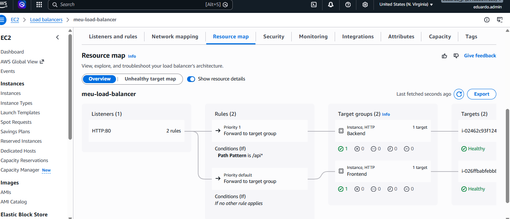

# aws-alb-path-routing-project
Deploy de aplicação com EC2 e Application Load Balancer utilizando roteamento por path (/api)
# aws-alb-path-routing-project
Deploy de aplicação com EC2 e Application Load Balancer utilizando roteamento por path (/api)
# 🚀 AWS ALB Path Routing Project

## 📌 Sobre o Projeto

Este projeto demonstra a implementação de uma arquitetura na AWS utilizando **Application Load Balancer (ALB)** para realizar roteamento por path entre frontend e backend.

O objetivo foi simular um ambiente real de produção, separando serviços e aplicando boas práticas de infraestrutura.

---

## 🧱 Arquitetura


* 2 instâncias EC2:

  * Frontend
  * Backend
* Load Balancer configurado com roteamento por path:

  * `/` → Frontend
  * `/api/` → Backend
* Servidor web Apache (httpd)

---

## ⚙️ Tecnologias Utilizadas

* Amazon EC2
* Elastic Load Balancer (ALB)
* Apache (httpd)
* Linux (Amazon Linux)

---

## 🌐 Funcionamento

* Acesso principal:

  * `http://<LOAD-BALANCER-DNS>/` → Frontend
* Acesso à API:

  * `http://<LOAD-BALANCER-DNS>/api/` → Backend

---

## 🛠️ Configuração Básica

### Instalação do Apache

```bash
sudo yum install httpd -y
sudo systemctl start httpd
sudo systemctl enable httpd
```

### Frontend

```bash
echo "<h1>Frontend</h1>" | sudo tee /var/www/html/index.html
```

### Backend

```bash
sudo mkdir /var/www/html/api
echo "<h1>Backend API</h1>" | sudo tee /var/www/html/api/index.html
```

---

## 🔍 Troubleshooting (Problemas Resolvidos)

Durante o desenvolvimento, foram encontrados e resolvidos alguns problemas comuns em ambientes cloud:

* **503 Service Unavailable**

  * Causa: instância em Availability Zone não habilitada no Load Balancer

* **502 Bad Gateway**

  * Causa: Apache não estava rodando corretamente

* **Health Check Failed**

  * Causa: aplicação não respondendo na porta 80

* **404 Not Found**

  * Causa: rota `/api` não existia no servidor

* **301 Redirect (Apache)**

  * Causa: ausência de barra no final (`/api` → `/api/`)

---

## 📚 Aprendizados

* Configuração de Application Load Balancer
* Roteamento baseado em path
* Health checks
* Security Groups (firewall)
* Troubleshooting em ambiente AWS
* Estruturação de frontend e backend separados

---

## 🚀 Próximos Passos

* Implementação de HTTPS com certificado SSL
* Uso de domínio personalizado
* Melhoria na segurança (restrição de acesso às instâncias)
* Criação de API real com retorno em JSON

---
## 👨‍💻 Autor

Projeto desenvolvido por Eduardo Tomás Junior
Focado em aprendizado de Cloud Computing e Cibersegurança 🚀
